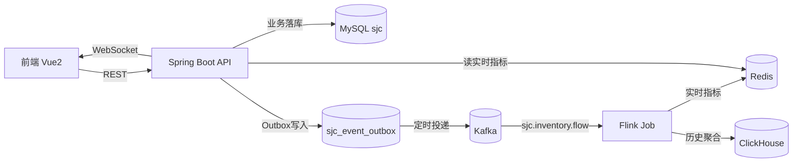

# 05 架构与数据流

## 总体架构（采集-计算-展示）

```mermaid
flowchart LR
A[前端 Vue2] -->|REST| B[Spring Boot API]
B -->|业务落库| C[(MySQL sjc)]
B -->|Outbox写入| O[(sjc_event_outbox)]
O -->|定时投递| K[(Kafka)]
K -->|sjc.inventory.flow| F[Flink Job]
F -->|实时指标| R[(Redis)]
F -->|历史聚合| H[(ClickHouse)]
B -->|WebSocket| A
B -->|读实时指标| R
```

## 关键链路
1. 出入库/调度写 MySQL（强一致）
2. 同事务或同业务阶段写 outbox
3. outbox 异步投递 Kafka
4. Flink 消费并写 Redis/ClickHouse
5. Dashboard 通过 REST + WS 实时展示
